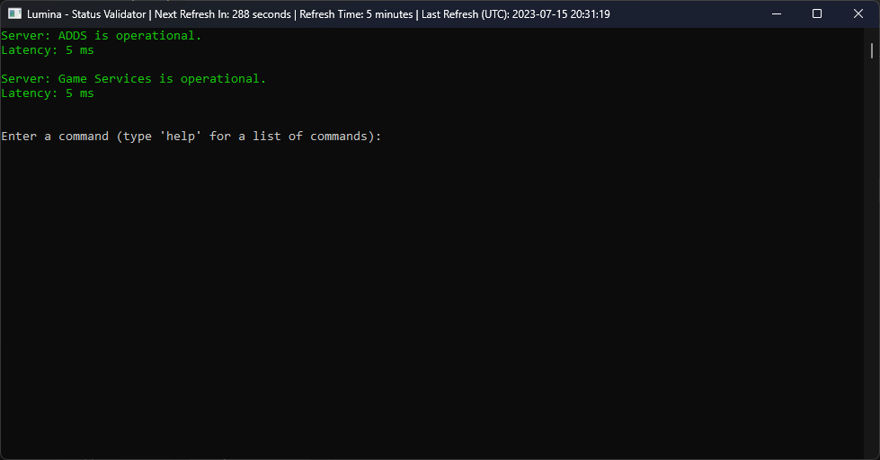

# Lumina Status Validator



The Lumina Status Validator is a command-line application that allows you to monitor the status of multiple servers. It provides real-time information about the server's availability, latency, and maintenance mode. You can configure the refresh time, add, edit, or remove servers, and query specific ports on the servers.

## Getting Started

### Installation

To use the Lumina Status Validator application, follow these steps:

1. Download the application files to your local machine.
2. Ensure that you have the [.NET runtime](https://dotnet.microsoft.com/download) installed on your system.

### Launching the Application

Open a command prompt or terminal, navigate to the directory where the application files are located, and run the following command to start the application:

```bash
dotnet run
```

## Available Commands

The Lumina Status Validator supports the following commands:

### help

Displays the available commands and their usage.

```bash
help
```

### info

Retrieves detailed information about a specific server.

```bash
info <ServerName>
```

- `<ServerName>`: The name of the server to retrieve information for. Enclose the server name in double quotes if it contains spaces.

### maintenance

Toggles the maintenance mode for a server. When a server is in maintenance mode, it is considered offline.

```bash
maintenance <ServerName>
```

- `<ServerName>`: The name of the server to toggle maintenance mode for. Enclose the server name in double quotes if it contains spaces.

### config

Configures the refresh time for server status checks.

```bash
config <Minutes>
```

- `<Minutes>`: The refresh time in minutes.

### clear

Clears the screen and displays the latest information about the servers.

```bash
clear
```

### exit

Exits the application.

```bash
exit
```

### add

Adds a new server to the server list.

```bash
add
```

You will be prompted to enter the server name and IP address.

### edit

Edits an existing server in the server list.

```bash
edit
```

You will be prompted to enter the server name and the new IP address.

### remove

Removes a server from the server list.

```bash
remove
```

You will be prompted to enter the server name.

### query

Queries a specific port on a server to check its status.

```bash
query <ServerName> <PortNumber>
```

- `<ServerName>`: The name of the server to query. Enclose the server name in double quotes if it contains spaces.
- `<PortNumber>`: The port number to query.

## Examples

Here are some examples to help you understand how to use the Lumina Status Validator:

- Retrieve detailed information about a server named "Game Server":

  ```bash
  info "Game Server"
  ```

  Output:

  ```
  Server: Game Server
  IP Address: 192.168.0.100
  Status: Online
  Latency: 5 ms
  ```

- Toggle maintenance mode for a server named "Database Server":

  ```bash
  maintenance "Database Server"
  ```

  Output:

  ```
  Server: Database Server is now in maintenance mode.
  ```

- Configure the refresh time to 10 minutes:

  ```bash
  config 10
  ```

  Output:

  ```
  Refresh time has been set to 10 minutes.
  ```

- Add a new server to the server list:

  ```bash
  add
  ```

  Prompt:

  ```
  Enter the server name: New Server
  Enter the server IP address: 192.168.0.200
  ```

  Output:

  ```
  Server added successfully.
  ```

- Remove a server from the server list:

  ```bash
  remove
  ```

  Prompt:

  ```
  Enter the server name: Old Server
  ```

  Output:

  ```
  Server removed successfully.
  ```

- Query port 8080 on a server named "Web Server":

  ```bash
  query "Web Server" 8080
  ```

  Output:

  ```
  Port 8080 on server 'Web Server' is open.
  ```

## Configuration

The Lumina Status Validator application provides configuration options for managing servers and the refresh time.

### Server List

The server list is stored in a JSON file named `config.json`. It contains the server names, IP addresses, and maintenance mode status. The file is automatically created and loaded when the application starts.

You can manually edit the `config.json` file to add, remove, or modify server entries.

### Refresh Time

The refresh time determines how often the application updates the server status. By default, the refresh time is set to 5 minutes. You can configure the refresh time using the `config` command followed by the desired number of minutes.

For example, to set the refresh time to 

10 minutes:

```bash
config 10
```

The application's title bar displays the current refresh time, next refresh countdown, and the last refresh time (in UTC). It updates in real-time to provide status information.

## Conclusion

Lumina Status Validator offers a compact and easy-to-use monitoring solution for efficiently managing the availability and status of multiple servers. With its intuitive command structure, customization options, and streamlined workflow, Lumina Status Validator simplifies server monitoring tasks and provides real-time insights to address any issues promptly. Whether you are a system administrator or an IT professional, Lumina Status Validator empowers you to proactively maintain the optimal performance of your server infrastructure. Start using Lumina Status Validator today and experience the convenience and efficiency it brings to server monitoring.
